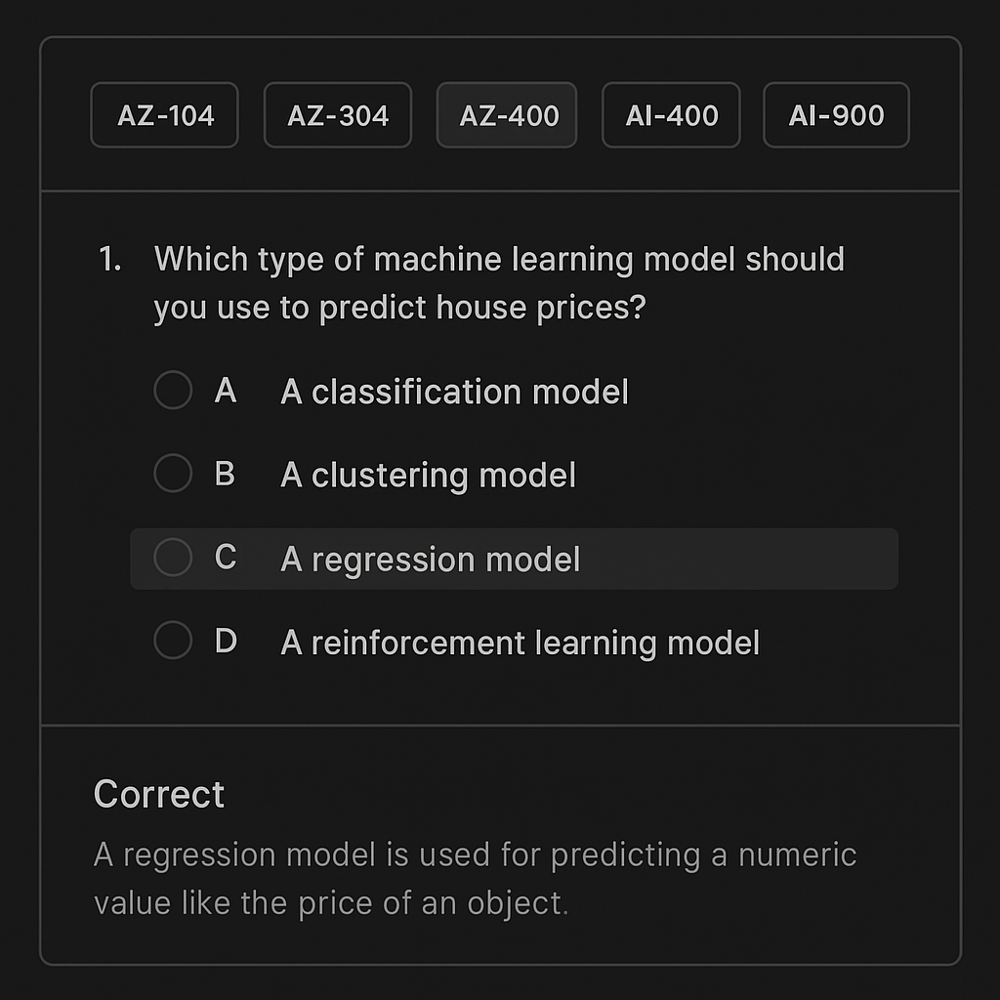
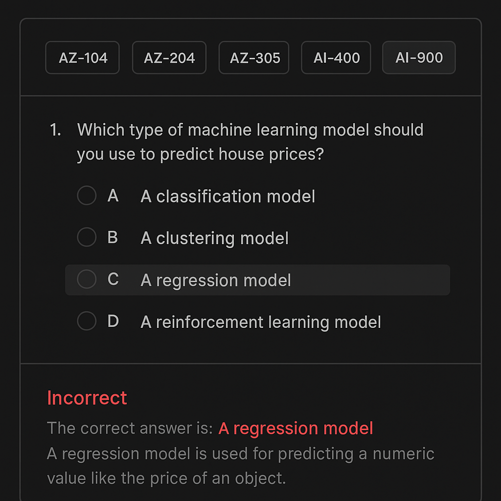

# Microsoft Certification Quiz App

An interactive, dark-mode web app for practicing Microsoft certification exams (AZ-104, AZ-204, AZ-305, AZ-400, AI-900, DP-900). Styled to match the Microsoft Learn knowledge check UI.

## ✨ Features

- Select from 6 Microsoft certification exams.
- Answer 50 randomly selected multiple-choice questions per quiz attempt.
- DP-900 quiz contains 600 unique, exam-style questions for comprehensive practice.
- Get instant feedback after each answer:
  - **Correct:** Green success box with explanation.
  - **Incorrect:** Red error box, correct answer highlighted, and explanation shown.
- Final score shown at the end of the quiz.
- Review screen displays all questions answered incorrectly, your answer, the correct answer, and an explanation.
- Clean, modern dark-mode interface using **Tailwind CSS**.
- Mobile-friendly and responsive.
- (Optional) Live scraping of latest questions from supported sources (if enabled).

## 🔢 Supported Exams

- AZ-104 (Microsoft Azure Administrator)
- AZ-204 (Developer)
- AZ-305 (Architect)
- AZ-400 (DevOps)
- AI-900 (AI Fundamentals)
- DP-900 (Data Fundamentals)

## 🧩 Data Sources

- **AZ-104:** [alekkip21/AZ-104-latest-exam-questions-2024](https://github.com/alekkip21/AZ-104-latest-exam-questions-2024)
- **AI-900:** [IsabellaS2/AI-900](https://github.com/IsabellaS2/AI-900)
- **DP-900:** 600 custom, exam-style questions based on the official exam outline and best practices.
- Other exams use mock questions in the same format.
- (Optional) Live scraping can be enabled to fetch the latest questions from public sources.

## 📁 File Structure

```
quiz-app/
├── public/
│   └── index.html
├── src/
│   ├── components/
│   │   ├── ExamSelector.tsx
│   │   ├── QuizContainer.tsx
│   │   ├── QuizQuestion.tsx
│   │   ├── QuizResults.tsx
│   ├── data/
│   │   ├── az104.json
│   │   ├── ai900.json
│   │   ├── az204.json
│   │   ├── az305.json
│   │   ├── az400.json
│   │   ├── dp900.json
│   ├── App.tsx
│   ├── index.tsx
│   ├── index.css
│   ├── types.ts
├── tailwind.config.js
├── package.json
└── README.md
```

## 📦 Tech Stack

- React (with hooks)
- Tailwind CSS
- JSON-based question loading
- (Optional) Live scraping via backend API or serverless function

## 📸 Wireframes

### ✅ Correct Answer State


### ❌ Incorrect Answer State


## 🚀 Running Locally

1. **Clone the repo:**
   ```bash
   git clone <your-repo-url>
   cd quiz-app
   ```
2. **Install dependencies:**
   ```bash
   npm install
   ```
3. **Run the app:**
   ```bash
   npm start
   # or
   npm run dev
   ```
4. **Visit:**
   ```
   http://localhost:3000
   ```

## 🧪 Sample Data Format

```json
{
  "exam": "AI-900",
  "questions": [
    {
      "id": 1,
      "question": "What is the primary goal of machine learning?",
      "options": [
        "To program computers with explicit instructions",
        "To allow systems to learn from data and improve over time",
        "To replace all human decision-making",
        "To create static models for prediction"
      ],
      "correct_answer_index": 1,
      "explanation": "Machine learning allows systems to learn patterns from data and make predictions or decisions without being explicitly programmed."
    }
  ]
}
```

## 📌 Notes

- Live scraping of questions is now supported (if enabled). Please ensure compliance with data source terms and applicable laws.
- Be mindful of licenses when using public GitHub repositories.
- Tailor explanations for accuracy and clarity.

---

Built with ❤️ to help developers pass Microsoft exams.
